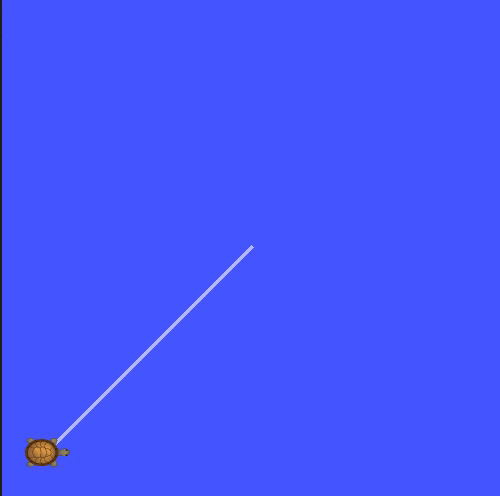

# ME 495 Embedded Systems
Maintained by Sarah Ziselman
## Overview
Nodes:
* `setup` - this node offers a service `/draw` where the `turtlesim` is cleared and marks an X at all the waypoints loaded in from the parameter server.
* `translate` - this node translates a `TurtleVelocity` message (containing linear and angular components) into a `geometry_msgs/Twist` message. The `Twist` message is published to the `/cmd_vel` topic, which controls the turtlesim.
* `follow` - this node offers a service `/restart` which calls the `/draw` service and then commands the turtle to start following the waypoints.

## Usage
Use the following command to launch the `run_waypoints.launch` launch file:
```
roslaunch turtle_control run_waypoints.launch
```
Using this command will launch the `turtlesim` simulator and the `setup`, `translate`, `follow` nodes.

## Configuration
In order to implement the `/draw` service, open another terminal and run the following command:
```
rosservice call /draw "{}"
```
Using this command will draw an X at all of the listed waypoints.

In order to implement the `/restart` service, open another terminal and run the following command:
```
rosservice call /restart "x: 0.0 y: 0.0"
```
where `x` is the starting x-location and `y` is the starting y-location of the turtle. Using this command will call the `/draw` service and then have the turtle begin following the waypoints.



